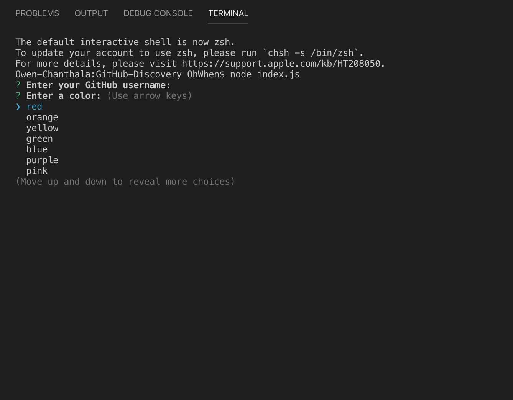
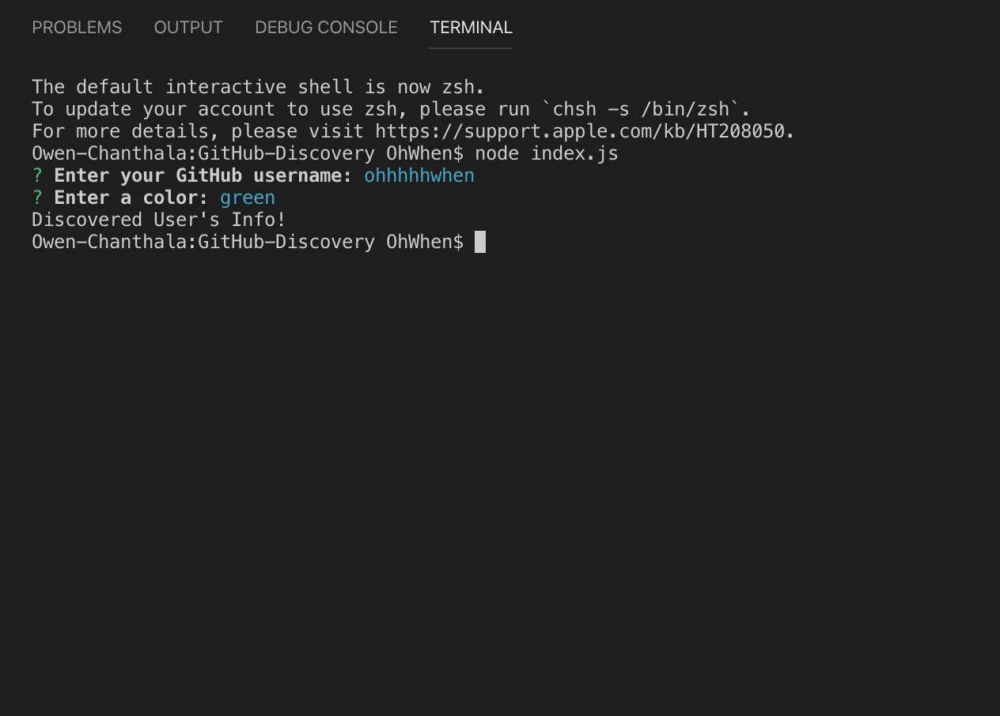
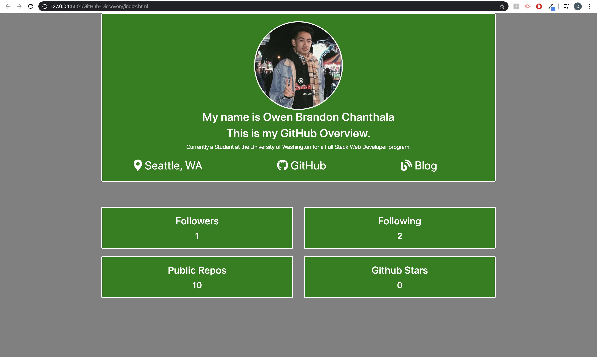
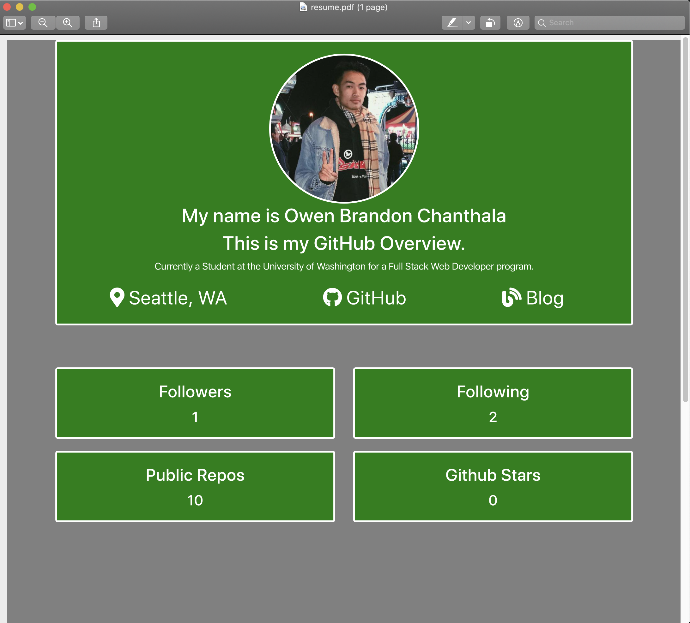

# GitHub-Discovery

## Table of contents
* [Deployed Repo](#deployed-repo)
* [Assignment Info](#assignment-info)
* [Technologies](#technologies)
* [Files](#files)
* [Key Notes](#key-notes)

## Deployed Repo
* HTML
https://ohhhhhwhen.github.io/GitHub-Discovery/

## Assignment info
The assignment starts out within the code/VS terminal. 
A prompt that ask to enter a GitHub username and then 
pick their color of choice. Which will then create an
html file with all their info as well as a pdf copy of
the html. The code consists of an inquirer which prompts
questoins, then using axios to grab information from the
github link. Using writeFileAsync and functions to create
both the html and pdf.
	
## Technologies
Project is created with:
* Bootstrap v4.4
* Visual Studios Code (HTML/CSS/JS/JQ)
* Google/W3
* Node.js
* Puppeteer
	
## Files / Running Page
* Here are some screen shots of the running page from an images folder:

 

 

 

 


## Key Notes
* Bootstrap link for html format

```
$ <link rel="stylesheet" href="https://stackpath.bootstrapcdn.com/bootstrap/4.3.1/css/bootstrap.min.css"
        integrity="sha384-ggOyR0iXCbMQv3Xipma34MD+dH/1fQ784/j6cY/iJTQUOhcWr7x9JvoRxT2MZw1T" crossorigin="anonymous">
```
